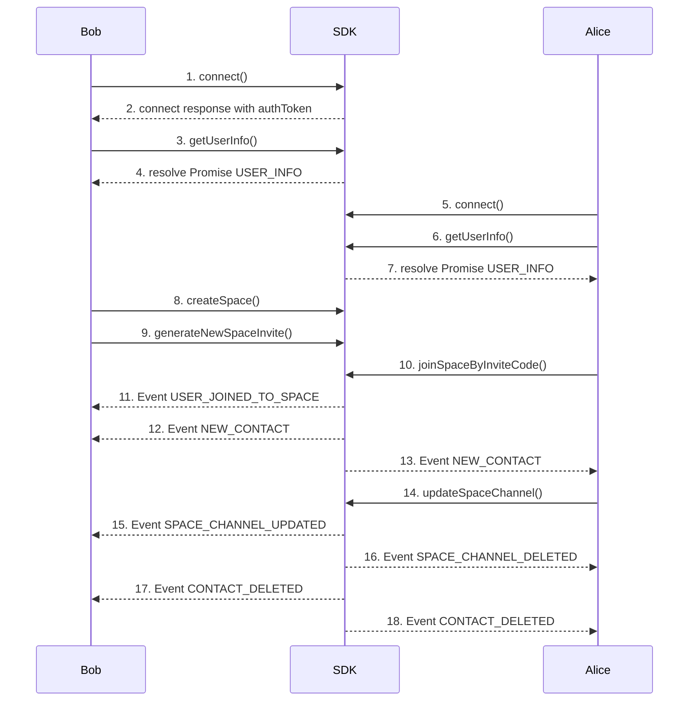

This page allows you to **connect** to the server, **create or join** a space, **manage categories**, **toggle channel privacy**, and view your **contacts**. It is designed so that **only the appropriate buttons and forms** appear, depending on your status (e.g., whether you're the space creator or an invited member).

### 1. Bob Connect
- Click on **Connect** button invoke  **[connect](connect)**  function on the SDK.
  Bob’s client opens a WebSocket session and authenticates.

**Call**
[Github (Lines 86–95)](https://github.com/flashphoner/MessengerSDKSamples/blob/1.0/src/hooks/sdk/useSdkConnection.ts#L86-L95)

**Doc**
[Github (Lines 71–84)](https://github.com/flashphoner/MessengerSDKSamples/blob/1.0/src/hooks/sdk/useSdkConnection.ts#L71-L84)

### 2. Receive authToken from **[connect](connect)** response
- used to bob's second connection
[Github (Lines 80–84)](https://github.com/flashphoner/MessengerSDKSamples/blob/1.0/src/hooks/sdk/useSdkConnection.ts#L80-L84)

### 3. Bob calls **[getUserInfo](getUserInfo)**
- After the connection is established, we are getting self-information about user
[Github (Lines 104)](https://github.com/flashphoner/MessengerSDKSamples/blob/1.0/src/hooks/sdk/useSdkConnection.ts#L104-L104)

### 4. Bob receives USER_INFO
- Information about user
[Github (Lines 98-102)](https://github.com/flashphoner/MessengerSDKSamples/blob/1.0/src/hooks/sdk/useSdkConnection.ts#L98-L102)

### 5. Alice Connect
- Click on **Connect** button invoke  **[connect](connect)**  function on the SDK.
  Alice’s client opens a WebSocket session and authenticates.
  
**Call**
[Github (Lines 86–95)](https://github.com/flashphoner/MessengerSDKSamples/blob/1.0/src/hooks/sdk/useSdkConnection.ts#L86-L95)

**Doc**
[Github (Lines 71–84)](https://github.com/flashphoner/MessengerSDKSamples/blob/1.0/src/hooks/sdk/useSdkConnection.ts#L71-L84)

### 6. Alice calls **[getUserInfo](getUserInfo)**
- After the connection is established, we are getting self-information about user
[Github (Lines 104)](https://github.com/flashphoner/MessengerSDKSamples/blob/1.0/src/hooks/sdk/useSdkConnection.ts#L104-L104)

### 7. Alice receives USER_INFO
- Information about user
[Github (Lines 98-102)](https://github.com/flashphoner/MessengerSDKSamples/blob/1.0/src/hooks/sdk/useSdkConnection.ts#L98-L102)

### 8. Bob calls **[createSpace](createSpace)**
- Enter a name for your new space and click Create.

**Call**
[Github (Lines 22)](https://github.com/flashphoner/MessengerSDKSamples/blob/1.0/src/hooks/sdk/useSdkSpaces.ts#L22-L22)

**Doc**
[Github (Lines 14-17)](https://github.com/flashphoner/MessengerSDKSamples/blob/1.0/src/hooks/sdk/useSdkSpaces.ts#L14-L17)

### 9. Bob calls **[generateNewSpaceInvite](generateNewSpaceInvite)**
- Click Generate space invite.
- Copy the invite code to share with teammates.

**Call**
[Github (Lines 55-57)](https://github.com/flashphoner/MessengerSDKSamples/blob/1.0/src/hooks/sdk/useSdkSpaces.ts#L55-L57)

**Doc**
[Github (Lines 47-50)](https://github.com/flashphoner/MessengerSDKSamples/blob/1.0/src/hooks/sdk/useSdkSpaces.ts#L47-L50)

### 10. Alice calls **[joinSpaceByInviteCode](joinSpaceByInviteCode)**
- Enter the Invite Code provided by the space creator, then click Join.

**Call**
[Github (Lines 74)](https://github.com/flashphoner/MessengerSDKSamples/blob/1.0/src/hooks/sdk/useSdkSpaces.ts#L74-L74)

**Doc**
[Github (Lines 66-69)](https://github.com/flashphoner/MessengerSDKSamples/blob/1.0/src/hooks/sdk/useSdkSpaces.ts#L66-L69)

### 11. Bob receives USER_JOINED_TO_SPACE
[Github (Lines 67–77)](https://github.com/flashphoner/MessengerSDKSamples/blob/1.0/src/events/space.ts#L67-L77)

### 12. Bob receives NEW_CONTACT
- Alice was added to Bob's contact list because they share a common space.
[Github (Lines 33–50)](https://github.com/flashphoner/MessengerSDKSamples/blob/1.0/src/events/contacts.ts#L33-L50)

### 13. Alice receives NEW_CONTACT
- Bob was added to Alice's contact list because they share a common space.
[Github (Lines 33–50)](https://github.com/flashphoner/MessengerSDKSamples/blob/1.0/src/events/contacts.ts#L33-L50)

### 14. Bob calls **[updateSpaceChannel](updateSpaceChannel)**
- Make channel private

**Call**
[Github (Lines 141)](https://github.com/flashphoner/MessengerSDKSamples/blob/1.0/src/hooks/sdk/useSdkSpaces.ts#L141-L141)

**Doc**
[Github (Lines 122-129)](https://github.com/flashphoner/MessengerSDKSamples/blob/1.0/src/hooks/sdk/useSdkSpaces.ts#L122-L129)

### 15. Bob receives SPACE_CHANNEL_UPDATED
[Github (Lines 46–57)](https://github.com/flashphoner/MessengerSDKSamples/blob/1.0/src/events/space.ts#L46-L57)

### 16. Alice receives SPACE_CHANNEL_DELETED
[Github (Lines 35–42)](https://github.com/flashphoner/MessengerSDKSamples/blob/1.0/src/events/space.ts#L35-L42)

### 17. Bob receives CONTACT_DELETED
- Alice will be deleted from contacts list.
[Github (Lines 57–63)](https://github.com/flashphoner/MessengerSDKSamples/blob/1.0/src/events/contacts.ts#L57-L63)

### 18. Alice receives CONTACT_DELETED
- Bob will be deleted from contacts list.
[Github (Lines 57–63)](https://github.com/flashphoner/MessengerSDKSamples/blob/1.0/src/events/contacts.ts#L57-L63)

### SDK Methods
---
| **Method**                                                | **Description**                                                 |
|-----------------------------------------------------------|-----------------------------------------------------------------|
| ****[connect](connect)****                                | Connect to the server using user credentials and shared tokens. |
| ****[disconnect](disconnect)****                          | Disconnect from the server.                                     |
| ****[getUserInfo](getUserInfo)****                        | Get information about user.                                     |
| ****[createSpace](createSpace)****                        | Create a new space.                                             |
| ****[generateNewSpaceInvite](generateNewSpaceInvite)****  | Generate an invite code for a space.                            |
| ****[joinSpaceByInviteCode](joinSpaceByInviteCode)****    | Join an existing space using invite code.                       |
| ****[leaveSpace](leaveSpace)****                          | Leave the current space.                                        |
| ****[updateSpaceChannel](updateSpaceChannel)****          | Change channel between public and private.                      |
| ****[getContacts](getContacts)****                        | Retrieve the list of contacts.                                  |
| ****[deleteSpace](deleteSpace)****                        | Delete space                                                    |
---
