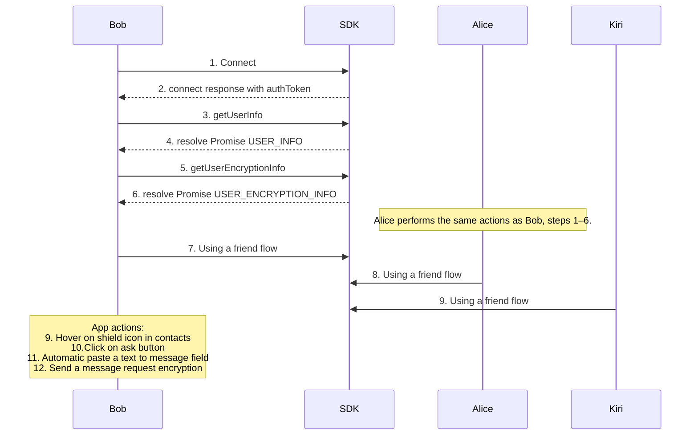
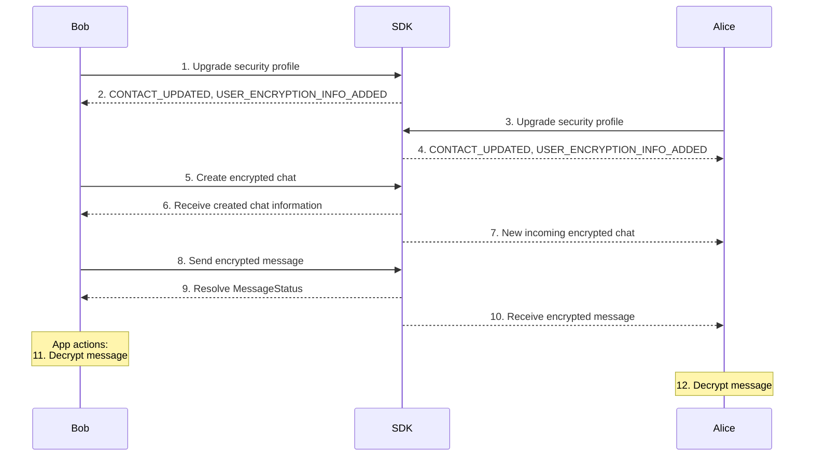

### 1. Connect
- Click on **Connect** button invoke  **[connect](connect)**  function on the SDK.

#### Call
[Github (Lines 86–95)](https://github.com/flashphoner/MessengerSDKSamples/blob/1.0/src/hooks/sdk/useSdkConnection.ts#L86-L95)

#### Doc
[Github (Lines 71–84)](https://github.com/flashphoner/MessengerSDKSamples/blob/1.0/src/hooks/sdk/useSdkConnection.ts#L71-L84)

### 2. Receive authToken from **[connect](connect)** response
[Github (Lines 80–84)](https://github.com/flashphoner/MessengerSDKSamples/blob/1.0/src/hooks/sdk/useSdkConnection.ts#L80-L84)

### 3. Call **[getUserInfo](getUserInfo)**
- After the connection is established, we are getting self-information about user
[Github (Lines 104)](https://github.com/flashphoner/MessengerSDKSamples/blob/1.0/src/hooks/sdk/useSdkConnection.ts#L104-L104)

### 4. Receive USER_INFO
- Information about user
  [Github (Lines 98-102)](https://github.com/flashphoner/MessengerSDKSamples/blob/1.0/src/hooks/sdk/useSdkConnection.ts#L98-L102)

### 5. Call **[getUserEncryptionInfo](getUserEncryptionInfo)**
- Retrieves encryption parameters previously saved for the user.
[Github (Lines 17)](https://github.com/flashphoner/MessengerSDKSamples/blob/1.0/src/hooks/sdk/useSdkEncryption.ts#L17-L17)

### 6. Response USER_ENCRYPTION_INFO

[Github (Lines 19–27)](https://github.com/flashphoner/MessengerSDKSamples/blob/1.0/src/hooks/sdk/useSdkEncryption.ts#L19-L27)

#### 7. [Bob friend flow](/#8-bob-s-friend-flow)
- Opens the [**Friends**](/) page to demonstrate [Bob’s friend flow](/#8-bob-s-friend-flow)

#### 8. [Alice friend flow](/#10-alice-receives-new_incoming_friend_invite)
- Opens the [**Friends**](/) page to demonstrate [Alice’s invite process](/#10-alice-receives-new_incoming_friend_invite)

### 9. Hover on shield icon in contacts card
- it show the tooltip with **"ASK"** button 
### 10. Click on ask button
- On clicking “ASK”, a simple (unencrypted) chat is created (see flow in [One to one chat](/oneToOneChat#8-bob-calls)). In this context, the chat is used to prompt the user to upgrade their profile.
### 11. Automatic paste a text to message field
- After created chat, we paste ask a text message to input field
### 12. Try to send the automatic paste text message
- **[sendMessage](sendMessage)**
- this is a simple sending message for user

#### Call
[Github (Lines 226–231)](https://github.com/flashphoner/MessengerSDKSamples/blob/1.0/src/components/containers/encryptedChat/panel/EncryptedChatPanel.tsx#L226-L231)

#### Doc
[Code (Lines 155–167)](https://gitlab.flashphoner.com/flashphoner-public/SFU-SDK-Extended-Samples/blob/zapp-1036/src/hooks/sdk/useSdkChats.ts#L155-L167)

### Encrypted chat workflow

#### 1. [Bob upgrades security profile](/upgradeSecurity#upgradepart)
- This page describes the security upgrade functionality for user profiles.

#### 2. Bob receives updated info
- After upgrading, the SDK sends [CONTACT_UPDATED](https://flashphoner.com//docs/api/WCS5/client/sfu-sdk/2.0/types/constants.ContactUpdated.html) and [USER_ENCRYPTION_INFO_ADDED](https://flashphoner.com//docs/api/WCS5/client/sfu-sdk/2.0/enums/constants.SfuEvent.html#USER_ENCRYPTION_INFO_ADDED)

#### 3. [Alice upgrades security profile](/upgradeSecurity#upgradepart)
- This page describes the security upgrade functionality for user profiles.

#### 4. Alice receives updated info
- After upgrading, Alice receives the [CONTACT_UPDATED](https://flashphoner.com//docs/api/WCS5/client/sfu-sdk/2.0/types/constants.ContactUpdated.html) and [USER_ENCRYPTION_INFO_ADDED](https://flashphoner.com//docs/api/WCS5/client/sfu-sdk/2.0/enums/constants.SfuEvent.html#USER_ENCRYPTION_INFO_ADDED)

### 5. Create encrypted chat
- **[createChat](createChat)** - sdk method
- [handleCreateChat()](https://gitlab.flashphoner.com/flashphoner-public/SFU-SDK-Extended-Samples/blob/zapp-1036/src/components/containers/encryptedChat/panel/EncryptedChatPanel.tsx#L138-L260) - call in a component
#### Call 
[Code (Lines 47–56)](https://gitlab.flashphoner.com/flashphoner-public/SFU-SDK-Extended-Samples/blob/zapp-1036/src/hooks/sdk/useSdkChats.ts#L47-L56)
#### Doc
[Code (Lines 25–37)](https://gitlab.flashphoner.com/flashphoner-public/SFU-SDK-Extended-Samples/blob/zapp-1036/src/hooks/sdk/useSdkChats.ts#L25-L37)
### See also
- Preparing fields to create encrypted chat
#### Call
[Code (Lines 153–153)](https://gitlab.flashphoner.com/flashphoner-public/SFU-SDK-Extended-Samples/blob/zapp-1036/src/components/containers/encryptedChat/panel/EncryptedChatPanel.tsx#L153-L153)
#### Doc
[Code (Lines 148–152)](https://gitlab.flashphoner.com/flashphoner-public/SFU-SDK-Extended-Samples/blob/zapp-1036/src/components/containers/encryptedChat/panel/EncryptedChatPanel.tsx#L148-L152)
### Attachment aes key
#### Call
[Code (Lines 158–158)](https://gitlab.flashphoner.com/flashphoner-public/SFU-SDK-Extended-Samples/blob/zapp-1036/src/components/containers/encryptedChat/panel/EncryptedChatPanel.tsx#L158-L158)
#### Doc
[GitHub (Lines 154–157)](https://gitlab.flashphoner.com/flashphoner-public/SFU-SDK-Extended-Samples/blob/zapp-1036/src/components/containers/encryptedChat/panel/EncryptedChatPanel.tsx#L154-L157)
### Convert to the aes key to string
#### Call
[GitHub (Lines 164–164)](https://gitlab.flashphoner.com/flashphoner-public/SFU-SDK-Extended-Samples/blob/zapp-1036/src/components/containers/encryptedChat/panel/EncryptedChatPanel.tsx#L164-L164)
#### Doc
[GitHub (Lines 159–163)](https://gitlab.flashphoner.com/flashphoner-public/SFU-SDK-Extended-Samples/blob/zapp-1036/src/components/containers/encryptedChat/panel/EncryptedChatPanel.tsx#L159-L163)
### Export private key to base64
#### Call
[GitHub (Lines 170–170)](https://gitlab.flashphoner.com/flashphoner-public/SFU-SDK-Extended-Samples/blob/zapp-1036/src/components/containers/encryptedChat/panel/EncryptedChatPanel.tsx#L170-L170)
#### Doc
[GitHub (Lines 165–169)](https://gitlab.flashphoner.com/flashphoner-public/SFU-SDK-Extended-Samples/blob/zapp-1036/src/components/containers/encryptedChat/panel/EncryptedChatPanel.tsx#L165-L169)
### Export public key to base64
#### Call
[GitHub (Lines 176–176)](https://gitlab.flashphoner.com/flashphoner-public/SFU-SDK-Extended-Samples/blob/zapp-1036/src/components/containers/encryptedChat/panel/EncryptedChatPanel.tsx#L176-L176)
#### Doc
[GitHub (Lines 171–175)](https://gitlab.flashphoner.com/flashphoner-public/SFU-SDK-Extended-Samples/blob/zapp-1036/src/components/containers/encryptedChat/panel/EncryptedChatPanel.tsx#L171-L175)
### Create chat password
#### Call 
[GitHub (Lines 181–181)](https://gitlab.flashphoner.com/flashphoner-public/SFU-SDK-Extended-Samples/blob/zapp-1036/src/components/containers/encryptedChat/panel/EncryptedChatPanel.tsx#L181-L181)
#### Doc
[GitHub (Lines 177–180)](https://gitlab.flashphoner.com/flashphoner-public/SFU-SDK-Extended-Samples/blob/zapp-1036/src/components/containers/encryptedChat/panel/EncryptedChatPanel.tsx#L177-L180)
### Encrypted private key with salt optional
#### Call
[GitHub (Lines 193–193)](https://gitlab.flashphoner.com/flashphoner-public/SFU-SDK-Extended-Samples/blob/zapp-1036/src/components/containers/encryptedChat/panel/EncryptedChatPanel.tsx#L193-L193)
#### Doc
[GitHub (Lines 186–192)](https://gitlab.flashphoner.com/flashphoner-public/SFU-SDK-Extended-Samples/blob/zapp-1036/src/components/containers/encryptedChat/panel/EncryptedChatPanel.tsx#L186-L192)
### Prepare members
[GitHub (Lines 198–198)](https://gitlab.flashphoner.com/flashphoner-public/SFU-SDK-Extended-Samples/blob/zapp-1036/src/components/containers/encryptedChat/panel/EncryptedChatPanel.tsx#L198-L198)
#### Doc
[GitHub (Lines 194–197)](https://gitlab.flashphoner.com/flashphoner-public/SFU-SDK-Extended-Samples/blob/zapp-1036/src/components/containers/encryptedChat/panel/EncryptedChatPanel.tsx#L194-L197)
### Prepare passwords
[GitHub (Lines 209–220)](https://gitlab.flashphoner.com/flashphoner-public/SFU-SDK-Extended-Samples/blob/zapp-1036/src/components/containers/encryptedChat/panel/EncryptedChatPanel.tsx#L209-L220)
#### Doc
[GitHub (Lines 199–208)](https://gitlab.flashphoner.com/flashphoner-public/SFU-SDK-Extended-Samples/blob/zapp-1036/src/components/containers/encryptedChat/panel/EncryptedChatPanel.tsx#L199-L208)
### Using prepared data
#### Call 
[GitHub (Lines 232–239)](https://gitlab.flashphoner.com/flashphoner-public/SFU-SDK-Extended-Samples/blob/zapp-1036/src/components/containers/encryptedChat/panel/EncryptedChatPanel.tsx#L232-L239)
#### Doc
[GitHub (Lines 221–231)](https://gitlab.flashphoner.com/flashphoner-public/SFU-SDK-Extended-Samples/blob/zapp-1036/src/components/containers/encryptedChat/panel/EncryptedChatPanel.tsx#L221-L231)

## 6. Bob receives created encrypted chat information
[UserSpecificChatInfo](https://flashphoner.com//docs/api/WCS5/client/sfu-sdk/2.0/types/constants.UserSpecificChatInfo.html)
## 7. Alice received event about new encrypted chat
[UserSpecificChatInfo](https://flashphoner.com//docs/api/WCS5/client/sfu-sdk/2.0/types/constants.UserSpecificChatInfo.html)

## 8. Bob sends the encrypted message to chat  **[sendMessage](sendMessage)**
#### Call
[GitHub (Lines 179–179)](https://gitlab.flashphoner.com/flashphoner-public/SFU-SDK-Extended-Samples/blob/zapp-1036/src/hooks/sdk/useSdkChats.ts#L179-L179)
#### Doc
[GitHub (Lines 155–167)](https://gitlab.flashphoner.com/flashphoner-public/SFU-SDK-Extended-Samples/blob/zapp-1036/src/hooks/sdk/useSdkChats.ts#L155-L167)
### See also
- get keys from service
#### Call
[GitHub (Lines 302–302)](https://gitlab.flashphoner.com/flashphoner-public/SFU-SDK-Extended-Samples/blob/zapp-1036/src/components/containers/encryptedChat/panel/EncryptedChatPanel.tsx#L302-L302)
#### Doc
[GitHub (Lines 297–301)](https://gitlab.flashphoner.com/flashphoner-public/SFU-SDK-Extended-Samples/blob/zapp-1036/src/components/containers/encryptedChat/panel/EncryptedChatPanel.tsx#L297-L301)
#### Encrypt message with a private key
#### Call
[GitHub (Lines 312–312)](https://gitlab.flashphoner.com/flashphoner-public/SFU-SDK-Extended-Samples/blob/zapp-1036/src/components/containers/encryptedChat/panel/EncryptedChatPanel.tsx#L312-L312)
#### Doc
[GitHub (Lines 306–311)](https://gitlab.flashphoner.com/flashphoner-public/SFU-SDK-Extended-Samples/blob/zapp-1036/src/components/containers/encryptedChat/panel/EncryptedChatPanel.tsx#L306-L311)
### Finally, call  **[sendMessage](sendMessage)**
[GitHub (Lines 322–327)](https://gitlab.flashphoner.com/flashphoner-public/SFU-SDK-Extended-Samples/blob/zapp-1036/src/components/containers/encryptedChat/panel/EncryptedChatPanel.tsx#L322-L327)
## 9. Bob resolves the MessageStatus
- [MessageStatus](https://flashphoner.com//docs/api/WCS5/client/sfu-sdk/2.0/types/constants.MessageStatus.html)
## 10. Alice receives the encrypted message
- [MessageStatus](https://flashphoner.com//docs/api/WCS5/client/sfu-sdk/2.0/types/constants.MessageStatus.html)

### 11. Bob decrypts message
- decrypt message function [handleDecryptMessage()](https://gitlab.flashphoner.com/flashphoner-public/SFU-SDK-Extended-Samples/blob/zapp-1036/src/components/ui/messageList/MessageList.tsx#L41-L121)

#### Call
[GitHub (Lines 112-112](https://gitlab.flashphoner.com/flashphoner-public/SFU-SDK-Extended-Samples/blob/zapp-1036/src/components/ui/messageList/MessageList.tsx#L112-L112)
#### Doc
[GitHub (Lines 106-111](https://gitlab.flashphoner.com/flashphoner-public/SFU-SDK-Extended-Samples/blob/zapp-1036/src/components/ui/messageList/MessageList.tsx#L106-L111)

### 12. Alice decrypts message
- decrypt message function [handleDecryptMessage()](https://gitlab.flashphoner.com/flashphoner-public/SFU-SDK-Extended-Samples/blob/zapp-1036/src/components/ui/messageList/MessageList.tsx#L41-L121)
#### Call
[GitHub (Lines 112-112](https://gitlab.flashphoner.com/flashphoner-public/SFU-SDK-Extended-Samples/blob/zapp-1036/src/components/ui/messageList/MessageList.tsx#L112-L112)
#### Doc
[GitHub (Lines 106-111](https://gitlab.flashphoner.com/flashphoner-public/SFU-SDK-Extended-Samples/blob/zapp-1036/src/components/ui/messageList/MessageList.tsx#L106-L111)

### See also
### What inside decrypt message function
### Get user keys
[GitHub (Lines 67-67](https://gitlab.flashphoner.com/flashphoner-public/SFU-SDK-Extended-Samples/blob/zapp-1036/src/components/ui/messageList/MessageList.tsx#L67-L67)
### Doc
[GitHub (Lines 62-66](https://gitlab.flashphoner.com/flashphoner-public/SFU-SDK-Extended-Samples/blob/zapp-1036/src/components/ui/messageList/MessageList.tsx#L62-L66)
### Get chat keys
[GitHub (Lines 76-76](https://gitlab.flashphoner.com/flashphoner-public/SFU-SDK-Extended-Samples/blob/zapp-1036/src/components/ui/messageList/MessageList.tsx#L76-L76)
### Doc
[GitHub (Lines 71-75](https://gitlab.flashphoner.com/flashphoner-public/SFU-SDK-Extended-Samples/blob/zapp-1036/src/components/ui/messageList/MessageList.tsx#L71-L75)
### Chat password
[GitHub (Lines 86-89](https://gitlab.flashphoner.com/flashphoner-public/SFU-SDK-Extended-Samples/blob/zapp-1036/src/components/ui/messageList/MessageList.tsx#L86-L89)
### Doc
[GitHub (Lines 80-85](https://gitlab.flashphoner.com/flashphoner-public/SFU-SDK-Extended-Samples/blob/zapp-1036/src/components/ui/messageList/MessageList.tsx#L80-L85)
### Decrypt chat private key
[GitHub (Lines 96-99](https://gitlab.flashphoner.com/flashphoner-public/SFU-SDK-Extended-Samples/blob/zapp-1036/src/components/ui/messageList/MessageList.tsx#L96-L99)
### Doc
[GitHub (Lines 90-95](https://gitlab.flashphoner.com/flashphoner-public/SFU-SDK-Extended-Samples/blob/zapp-1036/src/components/ui/messageList/MessageList.tsx#L90-L95)
### Import a chat private key
[GitHub (Lines 105-105](https://gitlab.flashphoner.com/flashphoner-public/SFU-SDK-Extended-Samples/blob/zapp-1036/src/components/ui/messageList/MessageList.tsx#L105-L105)
### Doc
[GitHub (Lines 100-104](https://gitlab.flashphoner.com/flashphoner-public/SFU-SDK-Extended-Samples/blob/zapp-1036/src/components/ui/messageList/MessageList.tsx#L100-L104)

### SDK Methods
---
| **Method**                                        | **Description**                                                                                               |
|---------------------------------------------------|---------------------------------------------------------------------------------------------------------------|
| ****[Connect](connect)****                        | Connect to the server using user credentials and shared tokens.                                               |
| ****[Disconnect](disconnect)****                  | Disconnect from the server.                                                                                   |
| ****[Add User Encryption Info](addUserEncryptionInfo)**** | Add encryption settings to the user's profile.                                                                |
| ****[Get User Encryption Info](getUserEncryptionInfo)**** | Retrieve the current encryption settings of the user's profile.                                               |
| ****[Create Chat](createChat)****                 | Create a new chat (regular or encrypted) and handle chat initialization.                                      |
| ****[Send Message](sendMessage)****               | Send a message (encrypted or unencrypted, depending on the chat's encryption status).                         |
| ****[Get User Chats](getUserChats)****            | Load the list of chats, including details on whether each chat is encrypted.                                  |
| ****[Get Contacts](getContacts)****               | Retrieve the list of contacts for managing or creating chats.                                                 |
| ****[Accept Friend Invite](acceptFriendInvite)**** | Accept an incoming friend request.                                                                            |
| ****[Add Friend](addFriend)****                   | Send a friend request to another user.                                                                        |
| ****[Remove Friend](removeFriend)****             | Remove a friend from your contact list.                                                                       |
