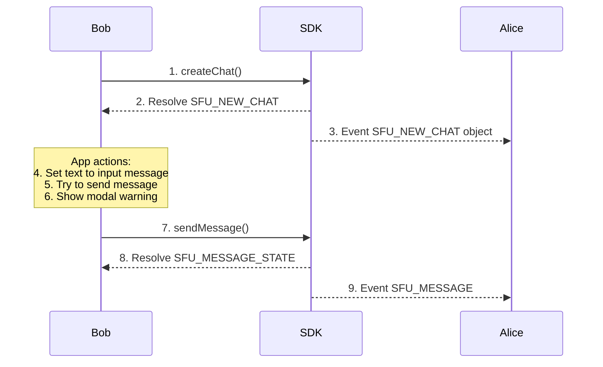
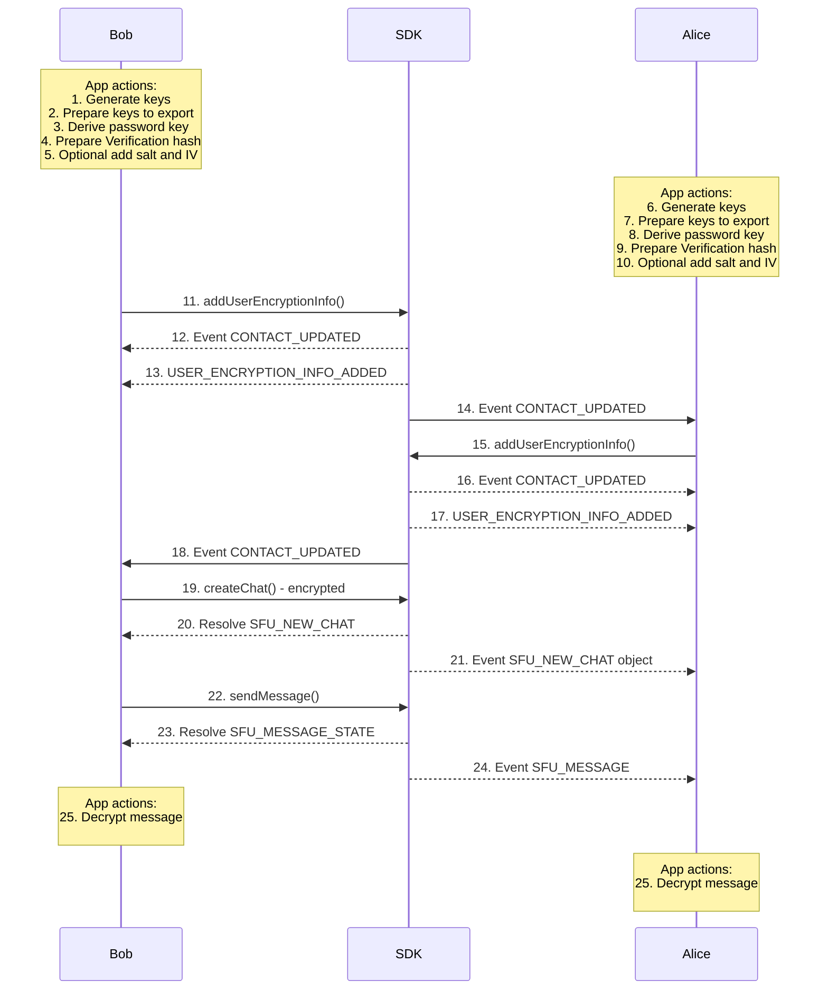

# Security‑Upgrade Prompt Flow (Bob ⇌ Alice)

### UI trigger (contacts list)

- In Bob’s **Contacts** panel each entry has a small **shield** icon to the right of the username.
- When Bob hovers over the shield, a tooltip appears with a **“Ask”** button.
- Pressing that button automatically
    1. opens (or focuses) a one‑on‑one chat with the contact;
    2. pre‑fills the input field with a polite request to enable profile encryption.

---

### Network sequence

1. **Bob → SDK — createChat()**  
   Bob’s client asks the server to create the dedicated chat.

2. **SDK → Bob — Resolve SFU_NEW_CHAT**  
   Server confirms creation and returns the chatId.

3. **SDK → Alice — Event SFU_NEW_CHAT**  
   Alice is notified in real time that a new chat with Bob exists.

#### App‑side actions (Bob)

4. The prepared upgrade message is already in the input box.
5. Bob presses **Send**.
6. A modal warning pops up:  
   *“This message will be sent unencrypted”*  
   Bob can **Cancel** or **Send anyway**.

7. **Bob → SDK — sendMessage()**  
   If Bob confirms, the request is dispatched.

8. **SDK → Bob — Resolve SFU_MESSAGE_STATE**  
   Server stores the message and marks its state as *sent*.

9. **SDK → Alice — Event SFU_MESSAGE**  
   Alice receives the plain‑text upgrade prompt in real time.

**Result:**  
Both users now see the conversation. Bob’s reminder remains visible until Alice finishes the profile‑encryption setup.

**Encrypted steps**
  - Upgrade profiles
  - Create encrypted chat
  - Send encrypted message
  - Decrypt message

# End‑to‑End Encryption Flow (Bob ⇌ Alice)

## Profile upgrade (per user)

### App actions:

### 1. Generate RSA Key Pair
[GitHub (Lines 1–13)](https://github.com/flashphoner/MessengerSDKSamples/blob/1.0/src/utils/encryption.ts#L1-L13)
- Required for encrypting your data.

#### 2. Export Keys to Base64

[GitHub (Lines 15–18)](https://github.com/flashphoner/MessengerSDKSamples/blob/1.0/src/utils/encryption.ts#L15-L18)

- **Purpose**: Converts the generated private key into a Base64 string for storage or transmission.
- **Usage**:
    1. After generating a key pair via **generateRSAKeyPair()**, call **exportPrivateKeyToBase64(privateKey)**.
    2. The returned Base64-encoded private key can be stored or sent to a server.

> **Important**: Always protect the Base64 private key. Encrypt it (e.g., with a password) before saving or transmitting.

[GitHub (Lines 34–37)](https://github.com/flashphoner/MessengerSDKSamples/blob/1.0/src/utils/encryption.ts#L34-L37)

- **Purpose**: Converts the generated public key into a Base64 string so that others can easily encrypt messages for you.
- **Usage**:
    1. Call **exportPublicKeyToBase64(publicKey)** after generating your RSA key pair.
    2. Store or share the Base64-encoded public key so other users can encrypt messages for you.

#### 3. Derive a key from the Master Password

[GitHub (Lines 53–75)](https://github.com/flashphoner/MessengerSDKSamples/blob/1.0/src/utils/encryption.ts#L53-L75)

- **Purpose**: Derives a cryptographic key from a user-supplied password now we are using static *MS-PASSWORD* value.
- **Usage**:
    - Internally used to generate a strong key from a user-chosen password or passphrase.
    - This derived key is then used to encrypt or decrypt the private key.

- Used to encrypt the private key securely.

### 4. Prepare verification hash
- Generate a verification hash by **MS-PASSWORD**.
  [GitHub (Lines 174 – 183)](https://github.com/flashphoner/MessengerSDKSamples/blob/1.0/src/utils/encryption.ts#L174-L183)

- Produces a one-way **SHA-256 fingerprint** that proves the client still possesses the correct master password, without revealing the password itself.
- Pass **verificationHash** inside **addUserEncryptionInfo()**

### 5. Encrypt the Private Key optional using IV and Salt
- IV and salt are embedded automatically or click on checkbox in *Encryption Options*
  [GitHub (Lines 96–114)](https://github.com/flashphoner/MessengerSDKSamples/blob/1.0/src/utils/encryption.ts#L96-L114)

- **Purpose**: Encrypts the Base64-encoded private key using a password-derived key, embedding the IV and salt in the resulting string.
- **Usage**:
    1. Get the Base64 private key via **exportPrivateKeyToBase64()**.
    2. Call **encryptPrivateKeyWithEmbeddedIvSalt(base64PrivateKey, password, useIVAndSalt)**.
    3. Store or send this **encrypted private key**, which contains the IV and salt.

### 6-10. Repeat key-generation flow (second user)
These steps mirror **6–10**, but are performed by the second user (Alice):

### 11-13. Persist encryption info (Bob)
- **11. addUserEncryptionInfo** — Bob uploads his *publicKey*, encrypted *privateKey*, IV and salt to the server.
- **12. CONTACT_UPDATED** — the server confirms Bob’s contact card was refreshed.
- **13. USER_ENCRYPTION_INFO_ADDED** — the server acknowledges Bob’s encryption data is now stored.

### 14–16. Persist encryption info (Alice)
- **14. CONTACT_UPDATED** — Event for Alice about Bob updates.
- **15. addUserEncryptionInfo** — Alice performs the same upload with her own keys.
- **16. CONTACT_UPDATED** — the server confirms Alice’s contact card was refreshed.
- **17. USER_ENCRYPTION_INFO_ADDED** — the server acknowledges Bob’s encryption data is now stored.
- **18. CONTACT_UPDATED** — Event for Bob about Alice's updates.
- 
## 19–25. Encrypted‑chat workflow (runtime)
- **19. Create encrypted chat**
    Bob calls **handleCreateEncryptedChat**, which
[GitHub (Lines 143–177)](https://github.com/flashphoner/MessengerSDKSamples/blob/1.0/src/components/containers/encryptedChat/panel/EncryptedChatPanel.tsx#L143-L177)
- generates a temporary RSA key pair and an AES‑256;
- creates a random chat password with **uuidv4()**;
- encrypts the chat’s private key with **encryptPrivateKeyWithEmbeddedIvSalt**;
- loops through every contact and for each one
    - imports the contact’s public key with **importPublicKeyFromBase64**,
    - encrypts the chat password using **encryptMessageWithPublicKey**,
    - appends the result to **encryptedChatPasswords**;
- finally invokes **handleCreateChat** with  
  publicKey, encryptedPrivateKey, encryptedChatPasswords and encryptedAttachmentsSecretKey.

- **20. Resolve SFU_NEW_CHAT** — server returns the final **chatId**; the client replaces the temporary id via **keyManagementService.replaceChatId**.

- **21. Event SFU_NEW_CHAT** — Alice receives chat metadata: Bob’s chat public key and her encrypted chat password.

- **22. sendMessage** — Inside **handleSendMessage** the plaintext is encrypted with the chat public key and dispatched to the server.

[GitHub (Lines 198–240)](https://github.com/flashphoner/MessengerSDKSamples/blob/1.0/src/components/containers/encryptedChat/panel/EncryptedChatPanel.tsx#L198-L240)

- **23. Resolve SFU_MESSAGE_STATE** — server stores the ciphertext and marks the message as **sent**.

- **24. Event SFU_MESSAGE** — Alice’s client receives the encrypted payload in real time.

- **25. Decrypt message**
  - Alice retrieves chat keys via **getChatKeys** from keyManagementService(first access decrypts them with her chat password).
  [GitHub (Lines 41–48)](https://github.com/flashphoner/MessengerSDKSamples/blob/1.0/src/services/keyManagementService.ts#L41-L48)
       
  - Passes the ciphertext to reveal the plaintext.
  [GitHub (Lines 162–172)](https://github.com/flashphoner/MessengerSDKSamples/blob/1.0/src/utils/encryption.ts#L162-L172)

**Result:** From this point on, every message and attachment in the chat is protected end‑to‑end.

### SDK Methods
---
| **Method**                                        | **Description**                                                                                               |
|---------------------------------------------------|---------------------------------------------------------------------------------------------------------------|
| ****[Connect](connect)****                        | Connect to the server using user credentials and shared tokens.                                               |
| ****[Disconnect](disconnect)****                  | Disconnect from the server.                                                                                   |
| ****[Add User Encryption Info](addUserEncryptionInfo)**** | Add encryption settings to the user's profile.                                                                |
| ****[Get User Encryption Info](getUserEncryptionInfo)**** | Retrieve the current encryption settings of the user's profile.                                               |
| ****[Create Chat](createChat)****                 | Create a new chat (regular or encrypted) and handle chat initialization.                                      |
| ****[Send Message](sendMessage)****               | Send a message (encrypted or unencrypted, depending on the chat's encryption status).                         |
| ****[Get User Chats](getUserChats)****            | Load the list of chats, including details on whether each chat is encrypted.                                  |
| ****[Get Contacts](getContacts)****               | Retrieve the list of contacts for managing or creating chats.                                                 |
| ****[Accept Friend Invite](acceptFriendInvite)**** | Accept an incoming friend request.                                                                            |
| ****[Add Friend](addFriend)****                   | Send a friend request to another user.                                                                        |
| ****[Remove Friend](removeFriend)****             | Remove a friend from your contact list.                                                                       |
