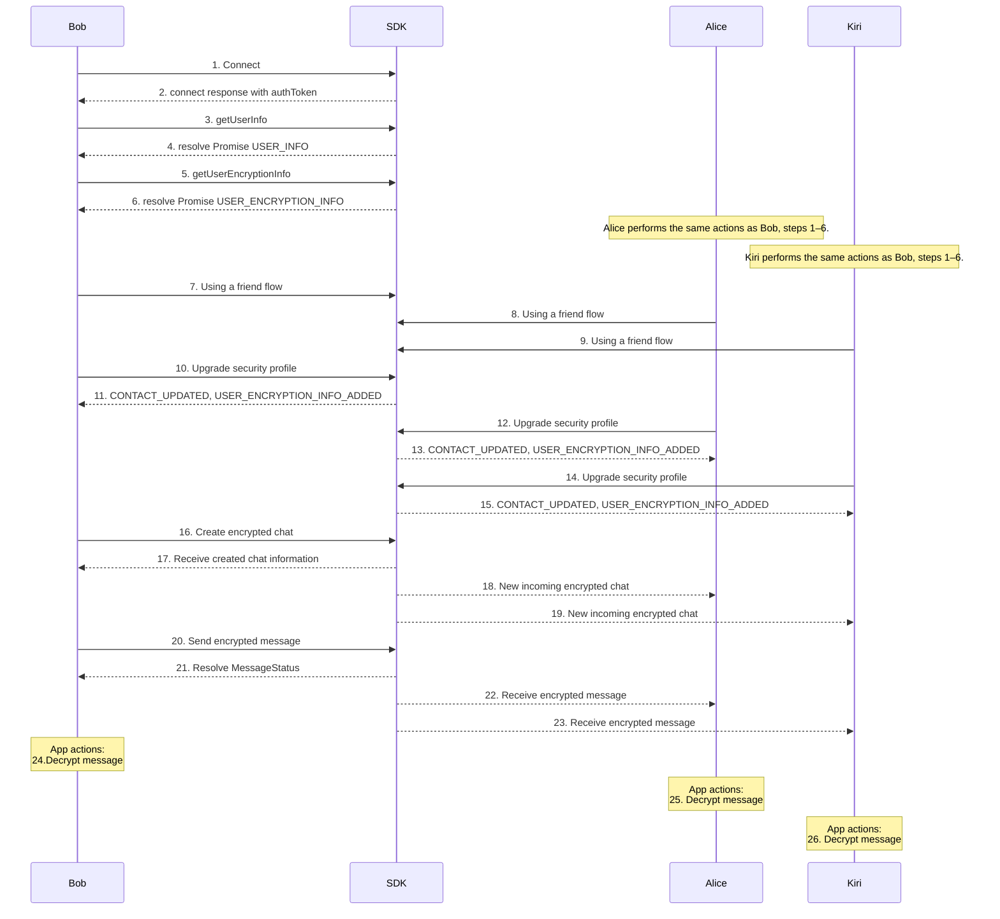

### 1. Connect
- Click on **Connect** button invoke **[connect](connect)** function on the SDK.

### Call
[Github (Lines 86–95)](https://github.com/flashphoner/MessengerSDKSamples/blob/1.0/src/hooks/sdk/useSdkConnection.ts#L86-L95)

### Doc
[Github (Lines 71–84)](https://github.com/flashphoner/MessengerSDKSamples/blob/1.0/src/hooks/sdk/useSdkConnection.ts#L71-L84)

### 2. Receive authToken from **[connect](connect)** response
[Github (Lines 80–84)](https://github.com/flashphoner/MessengerSDKSamples/blob/1.0/src/hooks/sdk/useSdkConnection.ts#L80-L84)

### 3. Call **[getUserInfo](getUserInfo)**
- After the connection is established, we are getting self-information about user
  [Github (Lines 104)](https://github.com/flashphoner/MessengerSDKSamples/blob/1.0/src/hooks/sdk/useSdkConnection.ts#L104-L104)

### 4. Receive USER_INFO
- Information about user
  [Github (Lines 98-102)](https://github.com/flashphoner/MessengerSDKSamples/blob/1.0/src/hooks/sdk/useSdkConnection.ts#L98-L102)

### 5. Call **[getUserEncryptionInfo](getUserEncryptionInfo)**
- Retrieves encryption parameters previously saved for the user.
  [Github (Lines 17)](https://github.com/flashphoner/MessengerSDKSamples/blob/1.0/src/hooks/sdk/useSdkEncryption.ts#L17-L17)

### 6. Response USER_ENCRYPTION_INFO

[Github (Lines 19–27)](https://github.com/flashphoner/MessengerSDKSamples/blob/1.0/src/hooks/sdk/useSdkEncryption.ts#L19-L27)

#### 7. [Bob friend flow](/#8-bob-friend-flow)
- Opens the [**Friends**](/) page to demonstrate [Bob’s friend flow](/#8-bob-friend-flow)

#### 8. [Alice friend flow](/#10-alice-receives-new_incoming_friend_invite)
- Opens the [**Friends**](/) page to demonstrate [Alice’s invite process](/#10-alice-receives-new_incoming_friend_invite)
#### 9. [Kiri receives updates about friendship like Alice](/#10-alice-receives-new_incoming_friend_invite)
- Opens the [**Friends**](/) page to demonstrate [Kiri's invitation process is the same as Alice's](/#10-alice-receives-new_incoming_friend_invite)

#### 10. [Bob upgrades security profile](/upgradeSecurity#upgradepart)
- This page describes the security upgrade functionality for user profiles.

#### 11. Bob receives updated info
- After upgrading, the SDK sends [CONTACT_UPDATED](https://flashphoner.com//docs/api/WCS5/client/sfu-sdk/2.0/types/constants.ContactUpdated.html) and [USER_ENCRYPTION_INFO_ADDED](https://flashphoner.com//docs/api/WCS5/client/sfu-sdk/2.0/types/constants.UserEncryptionInfo.html)

#### 12. [Alice upgrades security profile](/upgradeSecurity#upgradepart)
- This page describes the security upgrade functionality for user profiles.
#### 13. Alice receives updated info
- After upgrading, the SDK sends [CONTACT_UPDATED](https://flashphoner.com//docs/api/WCS5/client/sfu-sdk/2.0/types/constants.ContactUpdated.html) and [USER_ENCRYPTION_INFO_ADDED](https://flashphoner.com//docs/api/WCS5/client/sfu-sdk/2.0/types/constants.UserEncryptionInfo.html)
#### 14. [Kiri upgrades security profile](/upgradeSecurity#upgradepart)
- This page describes the security upgrade functionality for user profiles.
#### 15. Kiri receives updated info
- After upgrading, the SDK sends [CONTACT_UPDATED](https://flashphoner.com//docs/api/WCS5/client/sfu-sdk/2.0/types/constants.ContactUpdated.html) and [USER_ENCRYPTION_INFO_ADDED](https://flashphoner.com//docs/api/WCS5/client/sfu-sdk/2.0/types/constants.UserEncryptionInfo.html)
#### 16. Bob creates an encrypted group chat
- Select participants in the New chat card and then click on **Create**.
- **[createChat](createChat)** - sdk method
- [handleCreateEncryptedChat](https://gitlab.flashphoner.com/flashphoner-public/SFU-SDK-Extended-Samples/blob/zapp-1036/src/components/containers/encryptedGroupChat/panel/EncryptedGroupChatPanel.tsx#L95-L141) - call in a component
- more information about creating encrypted chat with see also block [here](/encryptedChat#5-create-encrypted-chat)
## 17. Bob receives created encrypted chat information
[UserSpecificChatInfo](https://flashphoner.com//docs/api/WCS5/client/sfu-sdk/2.0/types/constants.UserSpecificChatInfo.html)
## 18. Alice received event about new encrypted chat
[UserSpecificChatInfo](https://flashphoner.com//docs/api/WCS5/client/sfu-sdk/2.0/types/constants.UserSpecificChatInfo.html)
## 19. Kiri received event about new encrypted chat
[UserSpecificChatInfo](https://flashphoner.com//docs/api/WCS5/client/sfu-sdk/2.0/types/constants.UserSpecificChatInfo.html)
## 20. Bob sends the encrypted message to chat  **[sendMessage](sendMessage)**
#### Call
[GitHub (Lines 179–179)](https://gitlab.flashphoner.com/flashphoner-public/SFU-SDK-Extended-Samples/blob/zapp-1036/src/hooks/sdk/useSdkChats.ts#L179-L179)
#### Doc
[GitHub (Lines 155–167)](https://gitlab.flashphoner.com/flashphoner-public/SFU-SDK-Extended-Samples/blob/zapp-1036/src/hooks/sdk/useSdkChats.ts#L155-L167)
### See also
- get keys from service
#### Call
[GitHub (Lines 302–302)](https://gitlab.flashphoner.com/flashphoner-public/SFU-SDK-Extended-Samples/blob/zapp-1036/src/components/containers/encryptedChat/panel/EncryptedChatPanel.tsx#L302-L302)
#### Doc
[GitHub (Lines 297–301)](https://gitlab.flashphoner.com/flashphoner-public/SFU-SDK-Extended-Samples/blob/zapp-1036/src/components/containers/encryptedChat/panel/EncryptedChatPanel.tsx#L297-L301)
#### Encrypt message with a private key
#### Call
[GitHub (Lines 312–312)](https://gitlab.flashphoner.com/flashphoner-public/SFU-SDK-Extended-Samples/blob/zapp-1036/src/components/containers/encryptedChat/panel/EncryptedChatPanel.tsx#L312-L312)
#### Doc
[GitHub (Lines 306–311)](https://gitlab.flashphoner.com/flashphoner-public/SFU-SDK-Extended-Samples/blob/zapp-1036/src/components/containers/encryptedChat/panel/EncryptedChatPanel.tsx#L306-L311)
### Finally, call  **[sendMessage](sendMessage)**
[GitHub (Lines 322–327)](https://gitlab.flashphoner.com/flashphoner-public/SFU-SDK-Extended-Samples/blob/zapp-1036/src/components/containers/encryptedChat/panel/EncryptedChatPanel.tsx#L322-L327)
## 21. Bob resolves the MessageStatus
- [MessageStatus](https://flashphoner.com//docs/api/WCS5/client/sfu-sdk/2.0/types/constants.MessageStatus.html)
## 22. Alice receives the encrypted message
- [MessageStatus](https://flashphoner.com//docs/api/WCS5/client/sfu-sdk/2.0/types/constants.MessageStatus.html)
## 23. Kiri receives the encrypted message
- [MessageStatus](https://flashphoner.com//docs/api/WCS5/client/sfu-sdk/2.0/types/constants.MessageStatus.html)

### 24. Bob decrypts message
- decrypt message function [handleDecryptMessage()](https://gitlab.flashphoner.com/flashphoner-public/SFU-SDK-Extended-Samples/blob/zapp-1036/src/components/ui/messageList/MessageList.tsx#L41-L121)

#### Call
[GitHub (Lines 112-112](https://gitlab.flashphoner.com/flashphoner-public/SFU-SDK-Extended-Samples/blob/zapp-1036/src/components/ui/messageList/MessageList.tsx#L112-L112)
#### Doc
[GitHub (Lines 106-111](https://gitlab.flashphoner.com/flashphoner-public/SFU-SDK-Extended-Samples/blob/zapp-1036/src/components/ui/messageList/MessageList.tsx#L106-L111)

### 25. Alice decrypts message
- decrypt message function [handleDecryptMessage()](https://gitlab.flashphoner.com/flashphoner-public/SFU-SDK-Extended-Samples/blob/zapp-1036/src/components/ui/messageList/MessageList.tsx#L41-L121)
#### Call
[GitHub (Lines 112-112](https://gitlab.flashphoner.com/flashphoner-public/SFU-SDK-Extended-Samples/blob/zapp-1036/src/components/ui/messageList/MessageList.tsx#L112-L112)
#### Doc
[GitHub (Lines 106-111](https://gitlab.flashphoner.com/flashphoner-public/SFU-SDK-Extended-Samples/blob/zapp-1036/src/components/ui/messageList/MessageList.tsx#L106-L111)
### 26. Kiri decrypts message
- decrypt message function [handleDecryptMessage()](https://gitlab.flashphoner.com/flashphoner-public/SFU-SDK-Extended-Samples/blob/zapp-1036/src/components/ui/messageList/MessageList.tsx#L41-L121)
#### Call
[GitHub (Lines 112-112](https://gitlab.flashphoner.com/flashphoner-public/SFU-SDK-Extended-Samples/blob/zapp-1036/src/components/ui/messageList/MessageList.tsx#L112-L112)
#### Doc
[GitHub (Lines 106-111](https://gitlab.flashphoner.com/flashphoner-public/SFU-SDK-Extended-Samples/blob/zapp-1036/src/components/ui/messageList/MessageList.tsx#L106-L111)

### See also
### What inside decrypt message function
### Get user keys
[GitHub (Lines 67-67](https://gitlab.flashphoner.com/flashphoner-public/SFU-SDK-Extended-Samples/blob/zapp-1036/src/components/ui/messageList/MessageList.tsx#L67-L67)
### Doc
[GitHub (Lines 62-66](https://gitlab.flashphoner.com/flashphoner-public/SFU-SDK-Extended-Samples/blob/zapp-1036/src/components/ui/messageList/MessageList.tsx#L62-L66)
### Get chat keys
[GitHub (Lines 76-76](https://gitlab.flashphoner.com/flashphoner-public/SFU-SDK-Extended-Samples/blob/zapp-1036/src/components/ui/messageList/MessageList.tsx#L76-L76)
### Doc
[GitHub (Lines 71-75](https://gitlab.flashphoner.com/flashphoner-public/SFU-SDK-Extended-Samples/blob/zapp-1036/src/components/ui/messageList/MessageList.tsx#L71-L75)
### Chat password
[GitHub (Lines 86-89](https://gitlab.flashphoner.com/flashphoner-public/SFU-SDK-Extended-Samples/blob/zapp-1036/src/components/ui/messageList/MessageList.tsx#L86-L89)
### Doc
[GitHub (Lines 80-85](https://gitlab.flashphoner.com/flashphoner-public/SFU-SDK-Extended-Samples/blob/zapp-1036/src/components/ui/messageList/MessageList.tsx#L80-L85)
### Decrypt chat private key
[GitHub (Lines 96-99](https://gitlab.flashphoner.com/flashphoner-public/SFU-SDK-Extended-Samples/blob/zapp-1036/src/components/ui/messageList/MessageList.tsx#L96-L99)
### Doc
[GitHub (Lines 90-95](https://gitlab.flashphoner.com/flashphoner-public/SFU-SDK-Extended-Samples/blob/zapp-1036/src/components/ui/messageList/MessageList.tsx#L90-L95)
### Import a chat private key
[GitHub (Lines 105-105](https://gitlab.flashphoner.com/flashphoner-public/SFU-SDK-Extended-Samples/blob/zapp-1036/src/components/ui/messageList/MessageList.tsx#L105-L105)
### Doc
[GitHub (Lines 100-104](https://gitlab.flashphoner.com/flashphoner-public/SFU-SDK-Extended-Samples/blob/zapp-1036/src/components/ui/messageList/MessageList.tsx#L100-L104)

### SDK Methods
---
| **Method**                                        | **Description**                                                                                               |
|---------------------------------------------------|---------------------------------------------------------------------------------------------------------------|
| ****[Connect](connect)****                        | Connect to the server using user credentials and shared tokens.                                               |
| ****[Disconnect](disconnect)****                  | Disconnect from the server.                                                                                   |
| ****[Add User Encryption Info](addUserEncryptionInfo)**** | Add encryption settings to the user's profile.                                                                |
| ****[Get User Encryption Info](getUserEncryptionInfo)**** | Retrieve the current encryption settings of the user's profile.                                               |
| ****[Create Chat](createChat)****                 | Create a new chat (regular or encrypted) and handle chat initialization.                                      |
| ****[Send Message](sendMessage)****               | Send a message (encrypted or unencrypted, depending on the chat's encryption status).                         |
| ****[Get User Chats](getUserChats)****            | Load the list of chats, including details on whether each chat is encrypted.                                  |
| ****[Get Contacts](getContacts)****               | Retrieve the list of contacts for managing or creating chats.                                                 |
| ****[Accept Friend Invite](acceptFriendInvite)**** | Accept an incoming friend request.                                                                            |
| ****[Add Friend](addFriend)****                   | Send a friend request to another user.                                                                        |
| ****[Remove Friend](removeFriend)****             | Remove a friend from your contact list.                                                                       |
