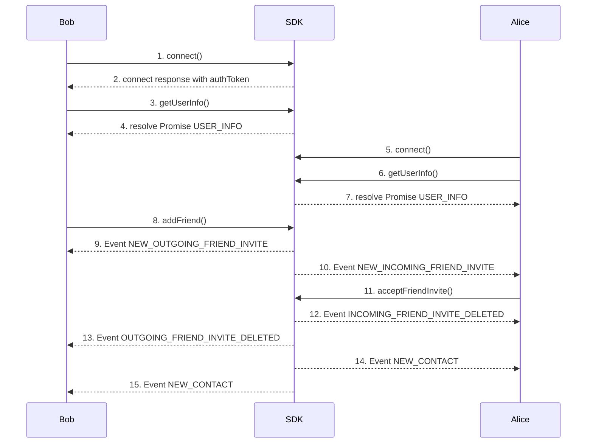

The **Friends** example page demonstrates how to use the SDK for managing server connections, friend requests, and friend lists.

# Friend‑Request Sequence - (Bob ⇌ Alice)

### 1. Bob Connect
- Click on **Connect** button invoke  **[connect](connect)**  function on the SDK.
  Bob’s client opens a WebSocket session and authenticates.

**Call**
[Github (Lines 86–95)](https://github.com/flashphoner/MessengerSDKSamples/blob/1.0/src/hooks/sdk/useSdkConnection.ts#L86-L95)

**Doc**
[Github (Lines 71–84)](https://github.com/flashphoner/MessengerSDKSamples/blob/1.0/src/hooks/sdk/useSdkConnection.ts#L71-L84)

### 2. Receive authToken from **[connect](connect)** response
- used to bob's second connection
[Github (Lines 80–84)](https://github.com/flashphoner/MessengerSDKSamples/blob/1.0/src/hooks/sdk/useSdkConnection.ts#L80-L84)

### 3. Bob calls **[getUserInfo](getUserInfo)**
- After the connection is established, we are getting self-information about user
[Github (Lines 104)](https://github.com/flashphoner/MessengerSDKSamples/blob/1.0/src/hooks/sdk/useSdkConnection.ts#L104-L104)

### 4. Bob receives USER_INFO
- Information about user
[Github (Lines 98-102)](https://github.com/flashphoner/MessengerSDKSamples/blob/1.0/src/hooks/sdk/useSdkConnection.ts#L98-L102)

### 5. Alice Connect
- Click on **Connect** button invoke  **[connect](connect)**  function on the SDK.
  Alice’s client opens a WebSocket session and authenticates.
  
**Call**
[Github (Lines 86–95)](https://github.com/flashphoner/MessengerSDKSamples/blob/1.0/src/hooks/sdk/useSdkConnection.ts#L86-L95)

**Doc**
[Github (Lines 71–84)](https://github.com/flashphoner/MessengerSDKSamples/blob/1.0/src/hooks/sdk/useSdkConnection.ts#L71-L84)

### 6. Alice calls **[getUserInfo](getUserInfo)**
- After the connection is established, we are getting self-information about user
[Github (Lines 104)](https://github.com/flashphoner/MessengerSDKSamples/blob/1.0/src/hooks/sdk/useSdkConnection.ts#L104-L104)

### 7. Alice receives USER_INFO
- Information about user
[Github (Lines 98-102)](https://github.com/flashphoner/MessengerSDKSamples/blob/1.0/src/hooks/sdk/useSdkConnection.ts#L98-L102)

### 8. Bob calls **[addFriend](addFriend)**
- Bob sends a friend request addressed to Alice’s userId.

**Call**
[Github (Lines 44–44)](https://github.com/flashphoner/MessengerSDKSamples/blob/1.0/src/hooks/sdk/useSdkContacts.ts#L44-L44)

**Doc**
[Github (Lines 36–39)](https://github.com/flashphoner/MessengerSDKSamples/blob/1.0/src/hooks/sdk/useSdkContacts.ts#L36-L39)

### 9. Bob receives NEW_OUTGOING_FRIEND_INVITE
- Confirmation that the request is now “pending.”
[Github (Lines 83–91)](https://github.com/flashphoner/MessengerSDKSamples/blob/1.0/src/events/contacts.ts#L83-L91)

### 10. Alice receives NEW_INCOMING_FRIEND_INVITE
- Push‑notification so Alice can accept or reject the request.
[Github (Lines 68–76)](https://github.com/flashphoner/MessengerSDKSamples/blob/1.0/src/events/contacts.ts#L68-L76)

## 11. Alice calls **[acceptFriendInvite](acceptFriendInvite)**
- Alice clicks “Accept.” in application. The SDK verifies the invite is still valid.

**Call**
[Github (Lines 71–71)](https://github.com/flashphoner/MessengerSDKSamples/blob/1.0/src/hooks/sdk/useSdkContacts.ts#L71-L71)

**Doc**
[Github (Lines 63–66)](https://github.com/flashphoner/MessengerSDKSamples/blob/1.0/src/hooks/sdk/useSdkContacts.ts#L63-L66)

### 12. Alice receives INCOMING_FRIEND_INVITE_DELETED
- The pending request is removed from Alice’s list.
[Github (Lines 98–104)](https://github.com/flashphoner/MessengerSDKSamples/blob/1.0/src/events/contacts.ts#L98-L104)

### 13. Bob receives OUTGOING_FRIEND_INVITE_DELETED
- Bob’s pending badge disappears the request is closed.
[Github (Lines 112–118)](https://github.com/flashphoner/MessengerSDKSamples/blob/1.0/src/events/contacts.ts#L112-L118)

### 14. Alice receives NEW_CONTACT
- Bob is added to Alice’s confirmed contacts.
[Github (Lines 33–50)](https://github.com/flashphoner/MessengerSDKSamples/blob/1.0/src/events/contacts.ts#L33-L50)

### 15. Bob receives NEW_CONTACT
- Alice is added to Bob’s confirmed contacts.
[Github (Lines 33–50)](https://github.com/flashphoner/MessengerSDKSamples/blob/1.0/src/events/contacts.ts#L33-L50)

###  Methods
---
| **Method**                                       | **Description**                                                 |
|--------------------------------------------------|-----------------------------------------------------------------|
| ****[connect](connect)****                       | Connect to the server using user credentials and shared tokens. |
| ****[disconnect](disconnect)****                 | Disconnect from the server.                                     |
| ****[getUserInfo](getUserInfo)****               | Get information about user.                                     |
| ****[addFriend](addFriend)****                   | Send a friend request.                                          |
| ****[revokeFriendInvite](revokeFriendInvite)**** | Revoke an outgoing friend request.                              |
| ****[acceptFriendInvite](acceptFriendInvite)**** | Accept an incoming friend request.                              |
| ****[rejectFriendInvite](rejectFriendInvite)**** | Reject an incoming friend request.                              |
| ****[getContacts](getContacts)****               | Retrieve the list of friends.                                   |
| ****[removeFriend](removeFriend)****             | Remove a friend from your list.                                 |
---
