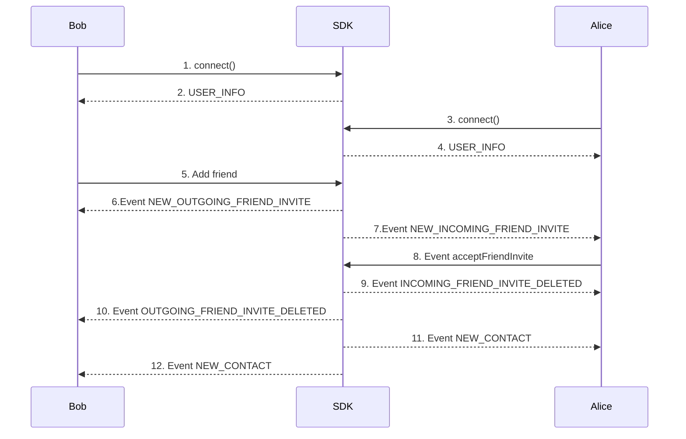

The **Friends** example page demonstrates how to use the SDK for managing server connections, friend requests, and friend lists.

# Friend‑Request Sequence - (Bob ⇌ Alice)

1. **Bob → SDK — connect()**  
   Bob’s client opens a WebSocket session and authenticates.

2. **SDK → Bob — USER_INFO**  
   The server returns Bob’s profile, feature flags, and authoritative userId.

3. **Alice → SDK — connect()**  
   Alice starts her own session (another tab or device).

4. **SDK → Alice — USER_INFO**  
   Same handshake data, scoped to Alice.

5. **Bob → SDK — addFriend(targetUserId)**  
   Bob sends a friend request addressed to Alice’s userId.

6. **SDK → Bob — NEW_OUTGOING_FRIEND_INVITE**  
   Confirmation that the request is now “pending.”

7. **SDK → Alice — NEW_INCOMING_FRIEND_INVITE**  
   Push‑notification so Alice can accept or reject the request.

8. **Alice → SDK — acceptFriendInvite(inviteId)**  
   Alice clicks “Accept.” in application. The SDK verifies the invite is still valid.

9. **SDK → Alice — INCOMING_FRIEND_INVITE_DELETED**  
   The pending request is removed from Alice’s list.

10. **SDK → Bob — OUTGOING_FRIEND_INVITE_DELETED**  
    Bob’s pending badge disappears the request is closed.

11. **SDK → Alice — NEW_CONTACT**  
    Bob is added to Alice’s confirmed contacts.

12. **SDK → Bob — NEW_CONTACT**  
    Alice is added to Bob’s confirmed contacts.

**Result:** After step-12 Bob and Alice are official contacts and can start chat.

**Ask user for upgrade to encrypted profile**
- Create a chat
- Send message for ask to upgrade security

## Key Features

- **Server Connection**: Connect or disconnect from a server.
- **Friend Requests**: Send, accept, reject, or revoke requests.
- **Pending Requests**: Manage incoming and outgoing requests.
- **Friend List**: View, refresh, and manage friends.

## How to Use

### 1. Server Connection

- Connect or disconnect using credentials.
- Status reflects connection state.
- If issues arise, check server URL and credentials.

### 2. Sending Friend Requests

- Enter a username or email and click **Add Friend**.
- An error is displayed if the username is incorrect.
- Track requests under **Pending Requests**.

### 3. Managing Pending Requests

- **Incoming Requests**: Accept or reject requests.
- **Outgoing Requests**: Revoke sent requests.
- Accepted requests move to the **Friends** list.

### 4. Friend List Management

- Use **Refresh** to update the list.
- Remove friends using **Remove Friend**.

###  Methods
---
| **Method**                          | **Description**                       |
|-------------------------------------|---------------------------------------|
| [Connect](connect)                  | Connect to the server.                |
| [Disconnect](disconnect)            | Disconnect from the server.           |
| [Add friend](addFriend)             | Send a friend request.                |
| [Revoke invite](revokeFriendInvite) | Revoke an outgoing friend request.    |
| [Accept friend](acceptFriendInvite) | Accept an incoming friend request.    |
| [Reject invite](rejectFriendInvite) | Reject an incoming friend request.    |
| [Get contacts](getContacts)         | Retrieve the list of friends.         |
| [Remove friend](removeFriend)       | Remove a friend from your list.       |

