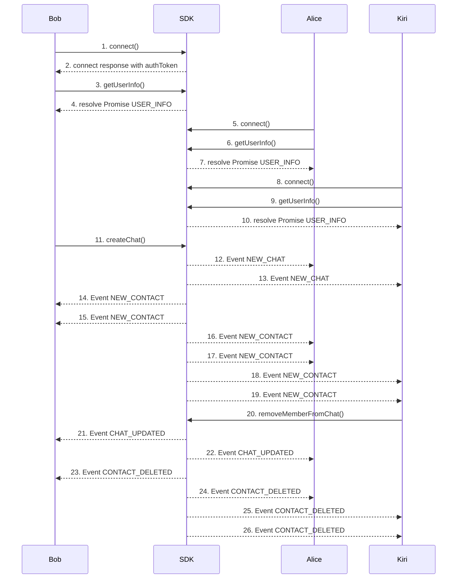

Use the **Group Chat** SDK to manage server connections, create group chats, and interact with contacts. This guide explains how group chats dynamically influence contact connections between users.

### 1. Bob Connect
- Click on **Connect** button invoke  **[connect](connect)**  function on the SDK.
  Bob’s client opens a WebSocket session and authenticates.

**Call**
[Github (Lines 86–95)](https://github.com/flashphoner/MessengerSDKSamples/blob/1.0/src/hooks/sdk/useSdkConnection.ts#L86-L95)

**Doc**
[Github (Lines 71–84)](https://github.com/flashphoner/MessengerSDKSamples/blob/1.0/src/hooks/sdk/useSdkConnection.ts#L71-L84)

### 2. Receive authToken from **[connect](connect)** response
- used to bob's second connection
[Github (Lines 80–84)](https://github.com/flashphoner/MessengerSDKSamples/blob/1.0/src/hooks/sdk/useSdkConnection.ts#L80-L84)

### 3. Bob calls **[getUserInfo](getUserInfo)**
- After the connection is established, we are getting self-information about user
[Github (Lines 104)](https://github.com/flashphoner/MessengerSDKSamples/blob/1.0/src/hooks/sdk/useSdkConnection.ts#L104-L104)

### 4. Bob receives USER_INFO
- Information about user
[Github (Lines 98-102)](https://github.com/flashphoner/MessengerSDKSamples/blob/1.0/src/hooks/sdk/useSdkConnection.ts#L98-L102)

### 5. Alice Connect
- Click on **Connect** button invoke  **[connect](connect)**  function on the SDK.
  Alice’s client opens a WebSocket session and authenticates.
  
**Call**
[Github (Lines 86–95)](https://github.com/flashphoner/MessengerSDKSamples/blob/1.0/src/hooks/sdk/useSdkConnection.ts#L86-L95)

**Doc**
[Github (Lines 71–84)](https://github.com/flashphoner/MessengerSDKSamples/blob/1.0/src/hooks/sdk/useSdkConnection.ts#L71-L84)

### 6. Alice calls **[getUserInfo](getUserInfo)**
- After the connection is established, we are getting self-information about user
[Github (Lines 104)](https://github.com/flashphoner/MessengerSDKSamples/blob/1.0/src/hooks/sdk/useSdkConnection.ts#L104-L104)

### 7. Alice receives USER_INFO
- Information about user
[Github (Lines 98-102)](https://github.com/flashphoner/MessengerSDKSamples/blob/1.0/src/hooks/sdk/useSdkConnection.ts#L98-L102)

### 8. Kiri Connect
- Click on **Connect** button invoke  **[connect](connect)**  function on the SDK.
  Kiri’s client opens a WebSocket session and authenticates.
  
**Call**
[Github (Lines 86–95)](https://github.com/flashphoner/MessengerSDKSamples/blob/1.0/src/hooks/sdk/useSdkConnection.ts#L86-L95)

**Doc**
[Github (Lines 71–84)](https://github.com/flashphoner/MessengerSDKSamples/blob/1.0/src/hooks/sdk/useSdkConnection.ts#L71-L84)

### 9. Kiri calls **[getUserInfo](getUserInfo)**
- After the connection is established, we are getting self-information about user
[Github (Lines 104)](https://github.com/flashphoner/MessengerSDKSamples/blob/1.0/src/hooks/sdk/useSdkConnection.ts#L104-L104)

### 10. Kiri receives USER_INFO
- Information about user
[Github (Lines 98-102)](https://github.com/flashphoner/MessengerSDKSamples/blob/1.0/src/hooks/sdk/useSdkConnection.ts#L98-L102)

### 11. Bob calls **[createChat](createChat)**
- Click **Create Group Chat** in the **Chat** section to establish a group chat between the connected users.

**Call**
[Github (Lines 47-56)](https://github.com/flashphoner/MessengerSDKSamples/blob/1.0/src/hooks/sdk/useSdkChats.ts#L47-L56)

**Doc**
[Github (Lines 25-37)](https://github.com/flashphoner/MessengerSDKSamples/blob/1.0/src/hooks/sdk/useSdkChats.ts#L25-L37)

### 12. Alice receives NEW_CHAT
[Github (Lines 20–54)](https://github.com/flashphoner/MessengerSDKSamples/blob/1.0/src/events/chat.ts#L20-L54)

### 13. Kiri receives NEW_CHAT
[Github (Lines 20–54)](https://github.com/flashphoner/MessengerSDKSamples/blob/1.0/src/events/chat.ts#L20-L54)

### 14-15. Bob receives two NEW_CONTACT
- Alice and Kiri were added to Bob's contact list because they share a common chat.
[Github (Lines 33–50)](https://github.com/flashphoner/MessengerSDKSamples/blob/1.0/src/events/contacts.ts#L33-L50)

### 16-17. Alice receives two NEW_CONTACT
- Bob and Kiri were added to Alice's contact list because they share a common chat.
[Github (Lines 33–50)](https://github.com/flashphoner/MessengerSDKSamples/blob/1.0/src/events/contacts.ts#L33-L50)

### 18-19. Kiri receives two NEW_CONTACT
- Bob and Alice were added to Kiri's contact list because they share a common chat.
[Github (Lines 33–50)](https://github.com/flashphoner/MessengerSDKSamples/blob/1.0/src/events/contacts.ts#L33-L50)

### 20. Kiri calls removeMemberFromChat()
- Call on ourselves to leave the chat

**Call**
[Github (Lines 95-98)](https://github.com/flashphoner/MessengerSDKSamples/blob/1.0/src/hooks/sdk/useSdkChats.ts#L95-L98)

**Doc**
[Github (Lines 85-89)](https://github.com/flashphoner/MessengerSDKSamples/blob/1.0/src/hooks/sdk/useSdkChats.ts#L85-L89)

### 21. Bob receives CHAT_UPDATED
- chat.members will be updated
[Github (Lines 103–137)](https://github.com/flashphoner/MessengerSDKSamples/blob/1.0/src/events/chat.ts#L103-L137)

### 22. Alice receives CHAT_UPDATED
- chat.members will be updated
[Github (Lines 103–137)](https://github.com/flashphoner/MessengerSDKSamples/blob/1.0/src/events/chat.ts#L103-L137)

### 23. Bob receives CONTACT_DELETED
- Kiri will be deleted from contacts list.
[Github (Lines 57–63)](https://github.com/flashphoner/MessengerSDKSamples/blob/1.0/src/events/contacts.ts#L57-L63)

### 24. Alice receives CONTACT_DELETED
- Kiri will be deleted from contacts list.
[Github (Lines 57–63)](https://github.com/flashphoner/MessengerSDKSamples/blob/1.0/src/events/contacts.ts#L57-L63)

### 25-26. Kiri receives two CONTACT_DELETED
- Bob and Alice will be deleted from contacts list.
[Github (Lines 57–63)](https://github.com/flashphoner/MessengerSDKSamples/blob/1.0/src/events/contacts.ts#L57-L63)

### SDK Methods
---
| **Method**                         | **Description**                                                 |
|------------------------------------|-----------------------------------------------------------------|
| ****[connect](connect)****         | Connect to the server using user credentials and shared tokens. |
| ****[disconnect](disconnect)****   | Disconnect from the server.                                     |
| ****[getUserInfo](getUserInfo)**** | Get information about user.                                     |
| ****[createChat](createChat)****   | Create a new chat with selected users.                          |
| ****[leaveChat](leaveChat)****     | Leave an existing group chat.                                   |
| ****[deleteChat](deleteChat)****   | Remove the group chat entirely.                                 |
| ****[getContacts](getContacts)**** | Retrieve the list of contacts.                                  |
---
