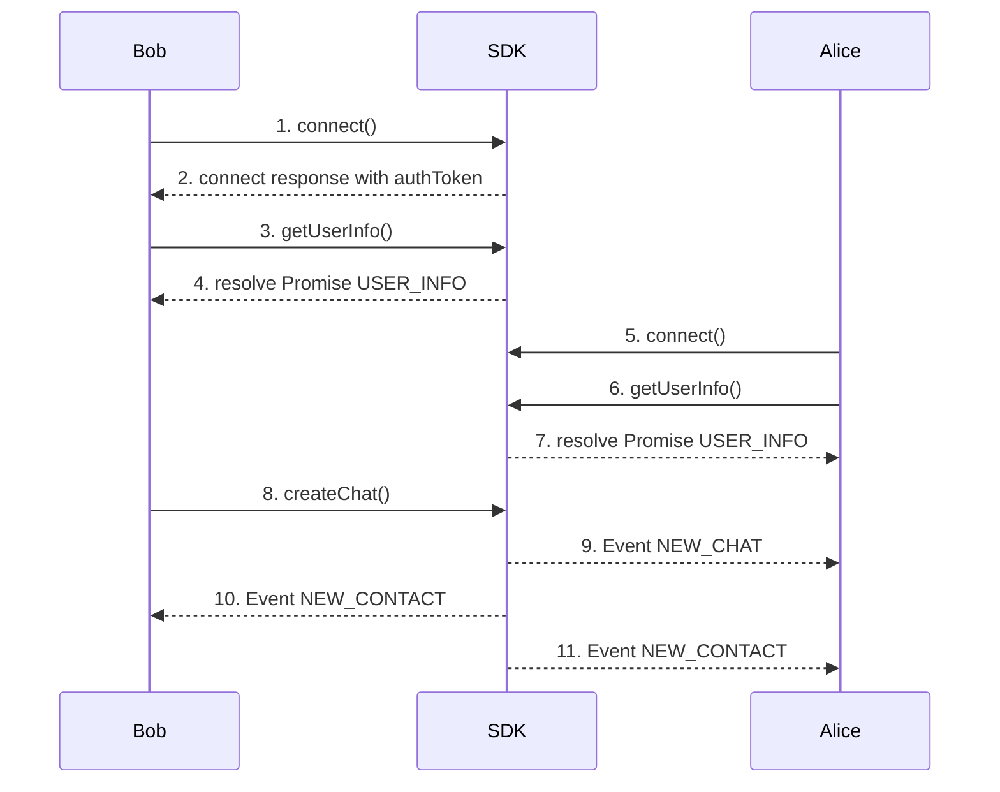

The **One-to-One Chat** page demonstrates a practical example of using the SDK for managing server connections, creating and managing chats, and interacting with contacts. This guide explains each section and includes critical notes about the behavior of chats and contact relationships.

### 1. Bob Connect
- Click on **Connect** button invoke  **[connect](connect)**  function on the SDK.
  Bob’s client opens a WebSocket session and authenticates.

**Call**
[Github (Lines 86–95)](https://github.com/flashphoner/MessengerSDKSamples/blob/1.0/src/hooks/sdk/useSdkConnection.ts#L86-L95)

**Doc**
[Github (Lines 71–84)](https://github.com/flashphoner/MessengerSDKSamples/blob/1.0/src/hooks/sdk/useSdkConnection.ts#L71-L84)

### 2. Receive authToken from **[connect](connect)** response
- used to bob's second connection
[Github (Lines 80–84)](https://github.com/flashphoner/MessengerSDKSamples/blob/1.0/src/hooks/sdk/useSdkConnection.ts#L80-L84)

### 3. Bob calls **[getUserInfo](getUserInfo)**
- After the connection is established, we are getting self-information about user
[Github (Lines 104)](https://github.com/flashphoner/MessengerSDKSamples/blob/1.0/src/hooks/sdk/useSdkConnection.ts#L104-L104)

### 4. Bob receives USER_INFO
- Information about user
[Github (Lines 98-102)](https://github.com/flashphoner/MessengerSDKSamples/blob/1.0/src/hooks/sdk/useSdkConnection.ts#L98-L102)

### 5. Alice Connect
- Click on **Connect** button invoke  **[connect](connect)**  function on the SDK.
  Alice’s client opens a WebSocket session and authenticates.
  
**Call**
[Github (Lines 86–95)](https://github.com/flashphoner/MessengerSDKSamples/blob/1.0/src/hooks/sdk/useSdkConnection.ts#L86-L95)

**Doc**
[Github (Lines 71–84)](https://github.com/flashphoner/MessengerSDKSamples/blob/1.0/src/hooks/sdk/useSdkConnection.ts#L71-L84)

### 6. Alice calls **[getUserInfo](getUserInfo)**
- After the connection is established, we are getting self-information about user
[Github (Lines 104)](https://github.com/flashphoner/MessengerSDKSamples/blob/1.0/src/hooks/sdk/useSdkConnection.ts#L104-L104)

### 7. Alice receives USER_INFO
- Information about user
[Github (Lines 98-102)](https://github.com/flashphoner/MessengerSDKSamples/blob/1.0/src/hooks/sdk/useSdkConnection.ts#L98-L102)

### 8. Bob calls **[createChat](createChat)**
- Click **Create Chat** in the **Chat** section to establish a one-to-one chat between the connected users.

**Call**
[Github (Lines 47-56)](https://github.com/flashphoner/MessengerSDKSamples/blob/1.0/src/hooks/sdk/useSdkChats.ts#L47-L56)

**Doc**
[Github (Lines 25-37)](https://github.com/flashphoner/MessengerSDKSamples/blob/1.0/src/hooks/sdk/useSdkChats.ts#L25-L37)

### 9. Alice receives NEW_CHAT
[Github (Lines 20–54)](https://github.com/flashphoner/MessengerSDKSamples/blob/1.0/src/events/chat.ts#L20-L54)

### 10. Bob receives NEW_CONTACT
- Alice was added to Bob's contact list because they share a common chat.
[Github (Lines 33–50)](https://github.com/flashphoner/MessengerSDKSamples/blob/1.0/src/events/contacts.ts#L33-L50)

### 11. Alice receives NEW_CONTACT
- Bob was added to Alice's contact list because they share a common chat.
[Github (Lines 33–50)](https://github.com/flashphoner/MessengerSDKSamples/blob/1.0/src/events/contacts.ts#L33-L50)

### Methods
---
| **Method**                         | **Description**                                                 |
|------------------------------------|-----------------------------------------------------------------|
| ****[connect](connect)****         | Connect to the server using user credentials and shared tokens. |
| ****[disconnect](disconnect)****   | Disconnect from the server.                                     |
| ****[getUserInfo](getUserInfo)**** | Get information about user.                                     |
| ****[createChat](createChat)****   | Create a one-to-one chat between two users.                     |
| ****[deleteChat](deleteChat)****   | Delete the chat and remove associated contacts.                 |
| ****[leaveChat](leaveChat)****     | Leave the chat and remove the relationship.                     |
| ****[getContacts](getContacts)**** | Retrieve the list of associated contacts.                       |
---
