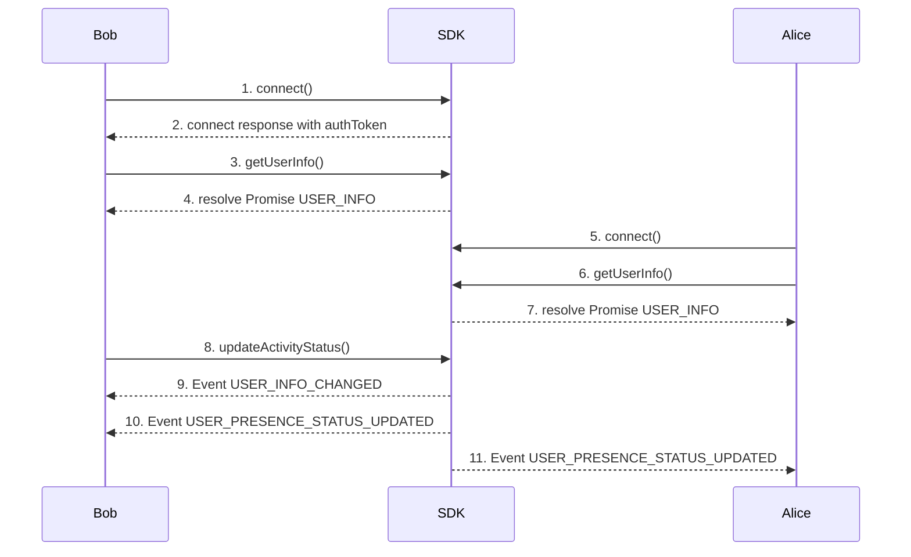

Use the **Presence Activity** SDK to manage server connections, update activity status, and interact with friends.



### 1. Bob Connect
- Click on **Connect** button invoke  **[connect](connect)**  function on the SDK.
  Bob’s client opens a WebSocket session and authenticates.

**Call**
[Github (Lines 86–95)](https://github.com/flashphoner/MessengerSDKSamples/blob/1.0/src/hooks/sdk/useSdkConnection.ts#L86-L95)

**Doc**
[Github (Lines 71–84)](https://github.com/flashphoner/MessengerSDKSamples/blob/1.0/src/hooks/sdk/useSdkConnection.ts#L71-L84)

### 2. Receive authToken from **[connect](connect)** response
- used to bob's second connection
[Github (Lines 80–84)](https://github.com/flashphoner/MessengerSDKSamples/blob/1.0/src/hooks/sdk/useSdkConnection.ts#L80-L84)

### 3. Bob calls **[getUserInfo](getUserInfo)**
- After the connection is established, we are getting self-information about user
[Github (Lines 104)](https://github.com/flashphoner/MessengerSDKSamples/blob/1.0/src/hooks/sdk/useSdkConnection.ts#L104-L104)

### 4. Bob receives USER_INFO
- Information about user
[Github (Lines 98-102)](https://github.com/flashphoner/MessengerSDKSamples/blob/1.0/src/hooks/sdk/useSdkConnection.ts#L98-L102)

### 5. Alice Connect
- Click on **Connect** button invoke  **[connect](connect)**  function on the SDK.
  Alice’s client opens a WebSocket session and authenticates.

**Call**
[Github (Lines 86–95)](https://github.com/flashphoner/MessengerSDKSamples/blob/1.0/src/hooks/sdk/useSdkConnection.ts#L86-L95)

**Doc**
[Github (Lines 71–84)](https://github.com/flashphoner/MessengerSDKSamples/blob/1.0/src/hooks/sdk/useSdkConnection.ts#L71-L84)

### 6. Alice calls **[getUserInfo](getUserInfo)**
- After the connection is established, we are getting self-information about user
[Github (Lines 104)](https://github.com/flashphoner/MessengerSDKSamples/blob/1.0/src/hooks/sdk/useSdkConnection.ts#L104-L104)

### 7. Alice receives USER_INFO
- Information about user
[Github (Lines 98-102)](https://github.com/flashphoner/MessengerSDKSamples/blob/1.0/src/hooks/sdk/useSdkConnection.ts#L98-L102)

### 8. Bob calls **[updateActivityStatus](updateActivityStatus)**
- Toggle your activity status (e.g., Idle/Active).

**Call**
[Github (Lines 38)](https://github.com/flashphoner/MessengerSDKSamples/blob/1.0/src/hooks/sdk/useSdkPresence.ts#L38-L38)

**Doc**
[Github (Lines 28-31)](https://github.com/flashphoner/MessengerSDKSamples/blob/1.0/src/hooks/sdk/useSdkPresence.ts#L28-L31)

### 9. Bob receives USER_INFO_CHANGED

```tsdoc
{
  userId: UserId,
  info: UserInfo
}
```

### 10. Bob receives USER_PRESENCE_STATUS_UPDATED
[Github (Lines 23–30)](https://github.com/flashphoner/MessengerSDKSamples/blob/1.0/src/events/presence.ts#L23-L30)

### 11. Alice receives USER_PRESENCE_STATUS_UPDATED
[Github (Lines 23–30)](https://github.com/flashphoner/MessengerSDKSamples/blob/1.0/src/events/presence.ts#L23-L30)

### SDK Methods
---
| **Method**                                           | **Description**                                                 |
|------------------------------------------------------|-----------------------------------------------------------------|
| ****[connect](connect)****                           | Connect to the server using user credentials and shared tokens. |
| ****[disconnect](disconnect)****                     | Disconnect from the server.                                     |
| ****[getUserInfo](getUserInfo)****                   | Get information about user.                                     |
| ****[updateActivityStatus](updateActivityStatus)**** | Toggle your activity state.                                     |
| ****[getContacts](getContacts)****                   | Retrieve the list of friends.                                   |
---
