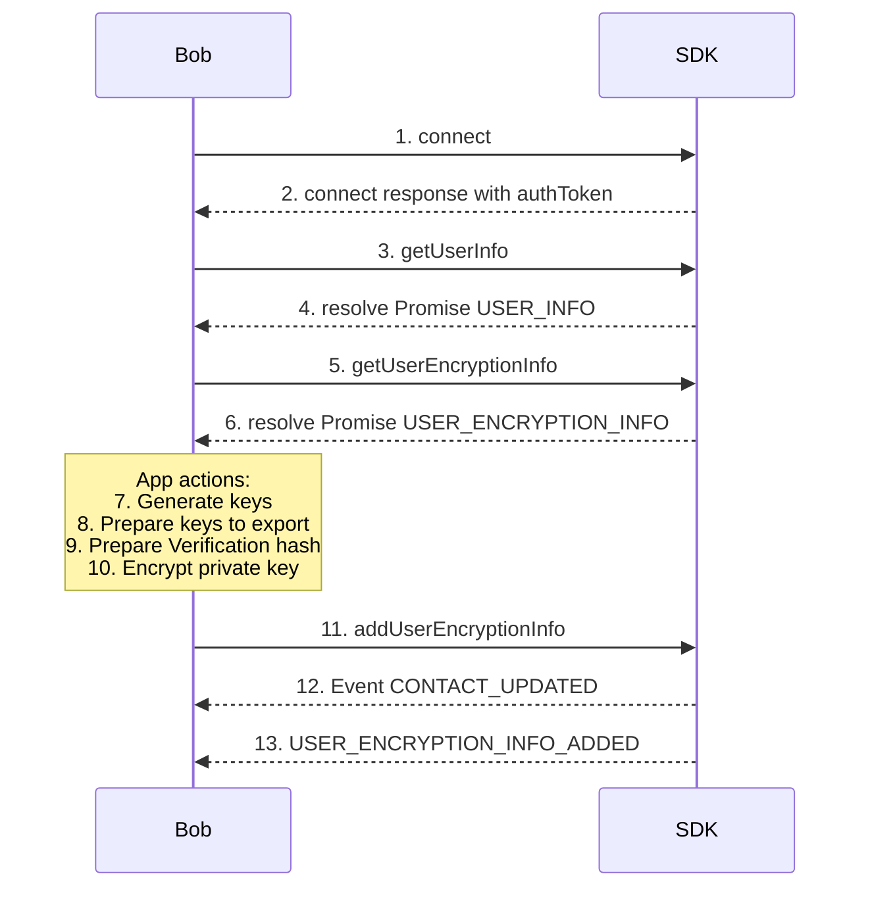

### 1. Connect
- Click on **Connect** button invoke  **[connect](connect)**  function on the SDK.

### Call
[Code (Lines 86–95)](https://gitlab.flashphoner.com/flashphoner-public/SFU-SDK-Extended-Samples/blob/zapp-1030/src/hooks/sdk/useSdkConnection.ts#L86-L95)

### Doc
[Code (Lines 71–84)](https://gitlab.flashphoner.com/flashphoner-public/SFU-SDK-Extended-Samples/blob/zapp-1030/src/hooks/sdk/useSdkConnection.ts#L71-L84)

### 2. Receive authToken from **[connect](connect)** response
[Code (Lines 80–84)](https://gitlab.flashphoner.com/flashphoner-public/SFU-SDK-Extended-Samples/blob/zapp-1030/src/hooks/sdk/useSdkConnection.ts#L80-L84)

### 3. Call **[getUserInfo](getUserInfo)**
- After the connection is established, we are getting self-information about user
[Code (Lines 104)](https://gitlab.flashphoner.com/flashphoner-public/SFU-SDK-Extended-Samples/blob/zapp-1030/src/hooks/sdk/useSdkConnection.ts#L104-L104)

### 4. Receive USER_INFO
- Information about user
[Code (Lines 98-102)](https://gitlab.flashphoner.com/flashphoner-public/SFU-SDK-Extended-Samples/blob/zapp-1030/src/hooks/sdk/useSdkConnection.ts#L98-L102)

### 5. Call **[getUserEncryptionInfo](getUserEncryptionInfo)**
- Retrieves encryption parameters previously saved for the user.
[Code (Lines 17)](https://gitlab.flashphoner.com/flashphoner-public/SFU-SDK-Extended-Samples/blob/zapp-1030/src/hooks/sdk/useSdkEncryption.ts#L17-L17)

### 6. Response USER_ENCRYPTION_INFO

[Code (Lines 19–27)](https://gitlab.flashphoner.com/flashphoner-public/SFU-SDK-Extended-Samples/blob/zapp-1030/src/hooks/sdk/useSdkEncryption.ts#L19-L27)

### App actions:
**Enable Salt & IV (optional)**
- After connecting, see the Encryption Options card.
- Check Use salt and IV to give each symmetric key its own salt and initialization vector.

**Generate encryption keys / Turn on encryption**
- In the Connect card, find the shield icon beside your username.
- Hover to reveal the tooltip and click Increase, or click Turn on Encryption in the final card both does the same routine.
- The app launches the key-generation flow (RSA/ECC pair plus optional salt & IV).
- When finished, the shield turns green and the final card updates to Encryption enabled, reflecting your current status in real time.

### 7. Generate RSA Key Pair and get keys from service
**Call**
[Code (Lines 25)](https://gitlab.flashphoner.com/flashphoner-public/SFU-SDK-Extended-Samples/blob/zapp-1030/src/hooks/encryption/useEncryption.ts#L25-L25)
**Doc**
[Code (Lines 27-33)](https://gitlab.flashphoner.com/flashphoner-public/SFU-SDK-Extended-Samples/blob/zapp-1030/src/hooks/encryption/useEncryption.ts#L27-L33)
- Required for encrypting your data.
- Inside **generateKeysForUser()** we are using a function **generateRSAKeyPair()** for generate keys

### See also
- Store the keys
[Code (Lines 14-23)](https://gitlab.flashphoner.com/flashphoner-public/SFU-SDK-Extended-Samples/blob/zapp-1030/src/services/keyManagementService.ts#L14-L23)
- Trying to generate keys
[Code (Lines 10-28)](https://gitlab.flashphoner.com/flashphoner-public/SFU-SDK-Extended-Samples/blob/zapp-1030/src/utils/encryption.ts#L10-L28)

### 8. Export Keys to Base64

**Call export private key**
[GitHub (Lines 31–31)](https://github.com/flashphoner/MessengerSDKSamples/blob/1.0/src/hooks/encryption/useEncryption.ts#L31-L31)

**Doc**
[GitHub (Lines 44–45)](https://gitlab.flashphoner.com/flashphoner-public/SFU-SDK-Extended-Samples/blob/zapp-1030/src/hooks/encryption/useEncryption.ts#L44-L45)

### See also
- Utils
[GitHub (Lines 29–52)](https://gitlab.flashphoner.com/flashphoner-public/SFU-SDK-Extended-Samples/blob/zapp-1030/src/utils/encryption.ts#L29-L52)

**Call export public key**
[GitHub (Lines 32–32)](https://github.com/flashphoner/MessengerSDKSamples/blob/1.0/src/hooks/encryption/useEncryption.ts#L32-L32)

- **Purpose**: Converts the generated private key into a Base64 string for storage or transmission.
- **Usage**:
    1. After generating a key pair via **generateKeysForUser()**, call **exportPrivateKeyToBase64(privateKey)**.
    2. The returned Base64-encoded private key can be stored or sent to a server.

> **Important**: Always protect the Base64 private key. Encrypt it (e.g., with a password) before saving or transmitting.

**Doc**
[GitHub (Lines 44–45)](https://gitlab.flashphoner.com/flashphoner-public/SFU-SDK-Extended-Samples/blob/zapp-1030/src/hooks/encryption/useEncryption.ts#L44-L45)
### See also
- Utils
[GitHub (Lines 54–77)](https://gitlab.flashphoner.com/flashphoner-public/SFU-SDK-Extended-Samples/blob/zapp-1030/src/utils/encryption.ts#L54-L77)

### 9. Prepare verification hash
- Generate a verification hash by **MS-PASSWORD**.
[GitHub (Lines 24)](https://github.com/flashphoner/MessengerSDKSamples/blob/1.0/src/hooks/encryption/useEncryption.ts#L24-L24)

**Call**
[GitHub (Lines 28)](https://github.com/flashphoner/MessengerSDKSamples/blob/1.0/src/hooks/encryption/useEncryption.ts#L28-L28)

**Doc**
[GitHub (Lines 36–39)](https://gitlab.flashphoner.com/flashphoner-public/SFU-SDK-Extended-Samples/blob/zapp-1030/src/hooks/encryption/useEncryption.ts#L36-L39)

- Produces a one-way **SHA-256 fingerprint** that proves the client still possesses the correct master password, without revealing the password itself.
- Pass **verificationHash** inside to sdk method **addUserEncryptionInfo()**

### See also 
- Hash function
[GitHub (Lines 276–290)](https://gitlab.flashphoner.com/flashphoner-public/SFU-SDK-Extended-Samples/blob/zapp-1030/src/utils/encryption.ts#L276-L290)

### 10. Encrypt the Private Key optional using IV and Salt
- IV and salt are embedded automatically or click on checkbox in *Encryption Options*
**Call**
[GitHub (Lines 53–57)](https://gitlab.flashphoner.com/flashphoner-public/SFU-SDK-Extended-Samples/blob/zapp-1030/src/hooks/encryption/useEncryption.ts#L53-L57)

- **Purpose**: Encrypts the Base64-encoded private key using a password-derived key, embedding the IV and salt in the resulting string.
- **Usage**:
    1. Get the Base64 private key via **exportPrivateKeyToBase64()**.
    2. Call **encryptPrivateKeyWithEmbeddedIvSalt(base64PrivateKey, password, useIVAndSalt)**.
    3. Store or send this **encrypted private key**, which contains the IV and salt.

### Doc
[GitHub (Lines 140–149)](https://gitlab.flashphoner.com/flashphoner-public/SFU-SDK-Extended-Samples/blob/zapp-1030/src/utils/encryption.ts#L140-L149)

### See also
- Full function what inside
[GitHub (Lines 151–171)](https://gitlab.flashphoner.com/flashphoner-public/SFU-SDK-Extended-Samples/blob/zapp-1030/src/utils/encryption.ts#L151-L171)
- Derive password
[GitHub (Lines 111-125)](https://gitlab.flashphoner.com/flashphoner-public/SFU-SDK-Extended-Samples/blob/zapp-1030/src/utils/encryption.ts#L111-L125)

### 11. Persist encryption info (Bob)
- **addUserEncryptionInfo** — Bob uploads his *publicKey*, encrypted *privateKey*, IV and salt to the server.

**Call**
[GitHub (Lines 69)](https://gitlab.flashphoner.com/flashphoner-public/SFU-SDK-Extended-Samples/blob/zapp-1030/src/hooks/sdk/useSdkEncryption.ts#L69-L69)

**Doc**
[GitHub (Lines 38-47)](https://gitlab.flashphoner.com/flashphoner-public/SFU-SDK-Extended-Samples/blob/zapp-1030/src/hooks/sdk/useSdkEncryption.ts#L38-L47)

### 12. Receive CONTACT_UPDATED
- The server emits **CONTACT_UPDATED** whenever it modifies a user’s contact record (encryption data).
- The payload below shows the typical structure after Bob enables encryption:
- When the user already has contacts, the SDK pushes **CONTACT_UPDATED** events to contacts.
### Doc
[GitHub (Lines 68–79)](https://gitlab.flashphoner.com/flashphoner-public/SFU-SDK-Extended-Samples/blob/zapp-1030/src/events/contacts.ts#L68-L79)

### 13. USER_ENCRYPTION_INFO_ADDED
- the server acknowledges Bob’s encryption data is now stored.

[GitHub (Lines 48-55)](https://gitlab.flashphoner.com/flashphoner-public/SFU-SDK-Extended-Samples/blob/zapp-1030/src/hooks/sdk/useSdkEncryption.ts#L48-L55)

###  SDK Methods

| **Method**                                             | **Description**                                                 |
|--------------------------------------------------------|-----------------------------------------------------------------|
| ****[connect](connect)****                             | Connect to the server using user credentials and shared tokens. |
| ****[disconnect](disconnect)****                       | Disconnect from the server.                                     |
| ****[getUserInfo](getUserInfo)****                     | Get information about user.                                     |
| ****[addUserEncryptionInfo](addUserEncryptionInfo)**** | Add encryption settings to the user's profile.                  |
| ****[getUserEncryptionInfo](getUserEncryptionInfo)**** | Retrieve the current encryption settings of the user's profile. |

